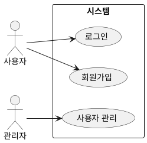
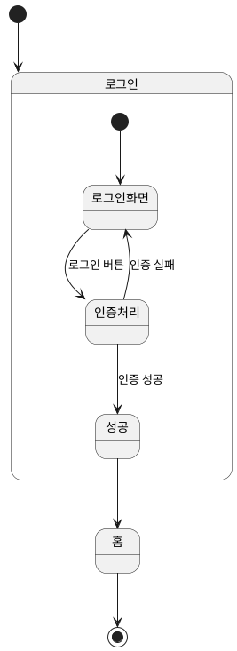
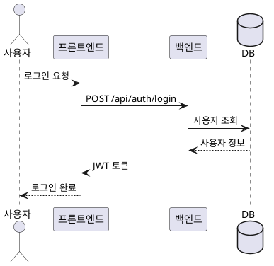
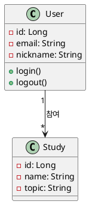
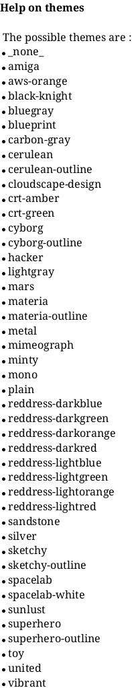

# PlantUML 설치 및 사용 가이드

## 1. VS Code 확장 설치

1. VS Code 실행
2. `Ctrl + Shift + X` (확장 마켓플레이스 열기)
3. **PlantUML** 검색 (jebbs.plantuml)
4. **Install** 클릭

## 2. Java 설치 (로컬 렌더링용)

PlantUML은 Java 기반이라 로컬에서 렌더링하려면 Java가 필요합니다.

### Java 설치 확인
```bash
java -version
```

### Java 미설치 시
- [Oracle JDK](https://www.oracle.com/java/technologies/downloads/) 또는
- [OpenJDK](https://adoptium.net/) 설치

### Java 없이 사용하기 (서버 모드)
Java 설치가 어려우면 PlantUML 서버를 사용할 수 있습니다.

1. `Ctrl + ,` (설정 열기)
2. `plantuml render` 검색
3. **Plantuml: Render** → `PlantUMLServer` 선택

## 3. 기본 사용법

### 파일 생성
- 확장자: `.puml` 또는 `.plantuml` 또는 `.wsd`
- 예: `UC_출석.puml`

### 미리보기
| 단축키 | 설명 |
|--------|------|
| `Alt + D` | 미리보기 창 열기 |
| `Ctrl + Shift + P` → "PlantUML: Preview" | 미리보기 열기 |

### 이미지 내보내기
1. `Ctrl + Shift + P`
2. "PlantUML: Export Current Diagram" 입력
3. 포맷 선택 (PNG, SVG, PDF 등)

### 전체 다이어그램 일괄 내보내기
1. `Ctrl + Shift + P`
2. "PlantUML: Export Workspace Diagrams" 입력

## 4. 기본 문법

### 유스케이스 다이어그램


### 화면 흐름도 (State Diagram)


### 시퀀스 다이어그램


### 클래스 다이어그램


## 5. 자주 쓰는 키워드

### 관계 표현
| 문법 | 의미 |
|------|------|
| `-->` | 일반 연결 |
| `..>` | 점선 연결 |
| `--\|>` | 상속 |
| `..> : <<include>>` | 포함 관계 |
| `..> : <<extend>>` | 확장 관계 |

### 스타일링
```plantuml
@startuml
!theme plain
skinparam backgroundColor #FEFEFE
skinparam actorStyle awesome
skinparam packageStyle rectangle
@enduml
```

### 노트 추가
```plantuml
note right of 로그인
  SSAFY OAuth 2.0 사용
end note

note bottom of 출석
  BLE 태깅으로 출석 체크
end note
```

### 색상 지정
```plantuml
actor 사용자 #LightBlue
usecase "로그인" as UC1 #LightGreen
```

## 6. 테마

### 기본 제공 테마
```plantuml
@startuml
!theme plain        ' 심플한 테마
!theme cerulean     ' 파란색 계열
!theme mars         ' 빨간색 계열
!theme spacelab     ' 우주 테마
@enduml
```

### 테마 목록 확인


## 7. 프로젝트 폴더 구조

```
diagrams/
├── usecase/          # 유스케이스 다이어그램
│   ├── UC_인증.puml
│   ├── UC_스터디.puml
│   └── ...
│
└── flow/             # 화면 흐름도
    ├── Flow_인증.puml
    ├── Flow_메인.puml
    └── ...
```

## 8. 문제 해결

### 미리보기가 안 될 때
1. Java 설치 확인
2. 서버 모드로 변경 (위의 "Java 없이 사용하기" 참고)
3. VS Code 재시작

### 한글이 깨질 때
1. 설정 → `plantuml.jar` 검색
2. 폰트 설정 추가:
```
skinparam defaultFontName "Malgun Gothic"
```

### 이미지가 잘릴 때
```plantuml
@startuml
scale 1.5
' 또는
scale max 1920 width
@enduml
```

## 9. 유용한 링크

- [PlantUML 공식 사이트](https://plantuml.com/)
- [PlantUML 온라인 에디터](https://www.plantuml.com/plantuml/uml/)
- [PlantUML 문법 가이드](https://plantuml.com/ko/guide)
- [VS Code 확장 마켓](https://marketplace.visualstudio.com/items?itemName=jebbs.plantuml)
