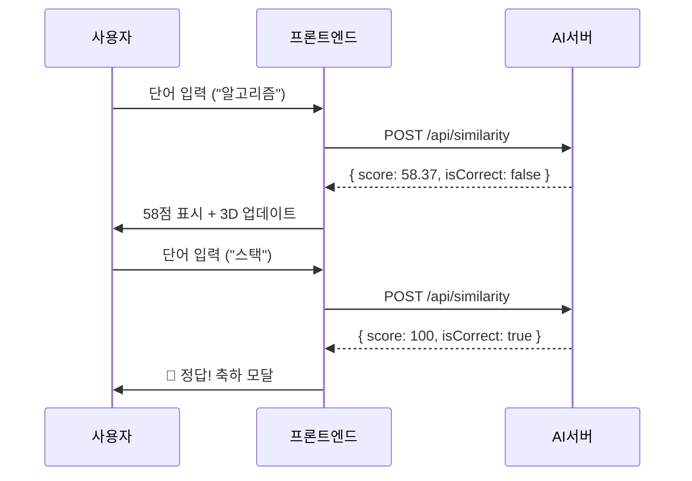

# 🎮 COMMENTLE - CS 단어 맞추기 게임

## 📌 개요

**COMMENTLE**은 "꼬멘틀(Contexto)"에서 영감을 받아 제작한 CS(Computer Science) 단어 유사도 기반 맞추기 게임입니다. 사용자가 입력한 단어가 정답과 얼마나 유사한지 AI가 분석하여 점수로 피드백합니다.

---

## 🧠 핵심 원리

### 1. 단어 임베딩 (Word Embedding)

- **사용 모델**: `jhgan/ko-sroberta-multitask` (한국어 Sentence-BERT)
- 단어를 고차원 벡터 공간에 매핑하여 **의미적 유사도**를 수치화합니다.
- 예: "스택"과 "큐"는 의미적으로 가까우므로 벡터 거리가 짧음

### 2. 코사인 유사도 (Cosine Similarity)

```
유사도 = (A · B) / (||A|| × ||B||)
```
- 두 벡터 사이의 **각도**를 측정하여 0~1 사이의 값을 반환
- 1에 가까울수록 유사 (100점)

### 3. 3D 시각화 (Embedding Visualization)

- **사용 기술**: React Three Fiber + Three.js
- 정답을 중심으로 사용자 입력을 **거리 기반**으로 배치
- 점수가 높을수록 중심에 가까움

---

## 🛠 기술 스택

| 영역 | 기술 | 설명 |
|------|------|------|
| **프론트엔드** | React + Vite | 빠른 개발 환경 |
| **3D 렌더링** | React Three Fiber | Three.js의 React 래퍼 |
| **3D 유틸** | @react-three/drei | 카메라, 텍스트, 컨트롤 등 헬퍼 |
| **스타일링** | Tailwind CSS + Vanilla CSS | 유연한 스타일링 |
| **상태관리** | React useState | 게임 상태 관리 |
| **백엔드 AI** | Flask + Sentence Transformers | 유사도 계산 API |

---

## 📂 폴더 구조

```
features/quiz/
├── Commentle/
│   ├── CommentleQuiz.jsx      # 메인 게임 컴포넌트
│   ├── QuizHeader.jsx         # 로고 및 제목
│   ├── QuizSubHeader.jsx      # 힌트 및 문제 정보
│   ├── QuizGuessInput.jsx     # 단어 입력 폼
│   ├── QuizInputlist.jsx      # 시도 이력 리스트
│   ├── Embedding3DViewer.jsx  # 3D 시각화
│   └── Commentle.css          # 스타일시트
├── services/
│   └── quizService.js         # API 호출 서비스
├── index.tsx                  # 진입점 (export)
└── COMMENTLE.md               # 이 문서
```

---

## 🎯 게임 흐름



---

## 📊 점수 기준

| 점수 범위 | 의미 | 색상 |
|----------|------|------|
| 95-100 | 🎯 정답 영역 | 초록 |
| 85-94 | 🔥 매우 가까움 | 연두 |
| 70-84 | 👍 가까움 | 파랑 |
| 50-69 | 🤔 중간 | 보라 |
| 30-49 | ❄️ 멀리 | 노랑 |
| 0-29 | 🌌 매우 멀리 | 빨강 |

---

## 🔧 백엔드 API 명세

### POST `/api/similarity`
```json
// Request
{
  "userWord": "정렬",
  "answerWord": "스택"
}

// Response
{
  "userWord": "정렬",
  "answerWord": "스택",
  "similarity": 0.5837,
  "score": 58.37,
  "isCorrect": false
}
```

### GET `/api/words/random`
```json
// Response
{
  "id": 2,
  "category": "자료구조",
  "difficulty": "easy",
  "hints": ["LIFO", "함수 호출 스택", "Back 버튼"]
}
```

---

## 🎨 3D 시각화 구현

### 핵심 컴포넌트

1. **CenterSphere**: 정답을 나타내는 중심 구체 (회전 애니메이션)
2. **UserPoint**: 사용자 입력을 나타내는 점 (호버 시 라벨 표시)
3. **ConnectionLine**: 정답과 사용자 입력을 잇는 선
4. **DistanceSpheres**: 거리 가이드용 반투명 구체들

### 거리 계산

```javascript
// 점수를 기반으로 거리 계산 (점수가 높을수록 가까움)
const distance = (100 - guess.score) / 100;

// 황금각을 사용한 균등 분포 배치
const phi = Math.acos(1 - 2 * (index + 1) / (guesses.length + 2));
const theta = Math.PI * (1 + Math.sqrt(5)) * (index + 1);
```

---

## 🚀 향후 개선 사항

- [ ] 백엔드 연동 (Mock → 실제 API)
- [ ] 매일 자동으로 문제 변경 로직
- [ ] 리더보드 DB 연동
- [ ] 소셜 공유 기능

---

## 👥 팀 정보

**SQUIZ** - SSAFY 공통 프로젝트 그룹
